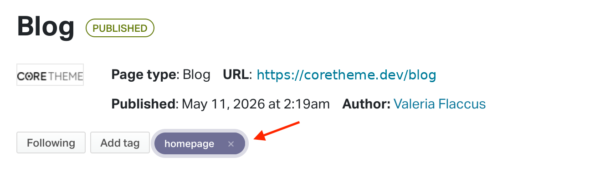
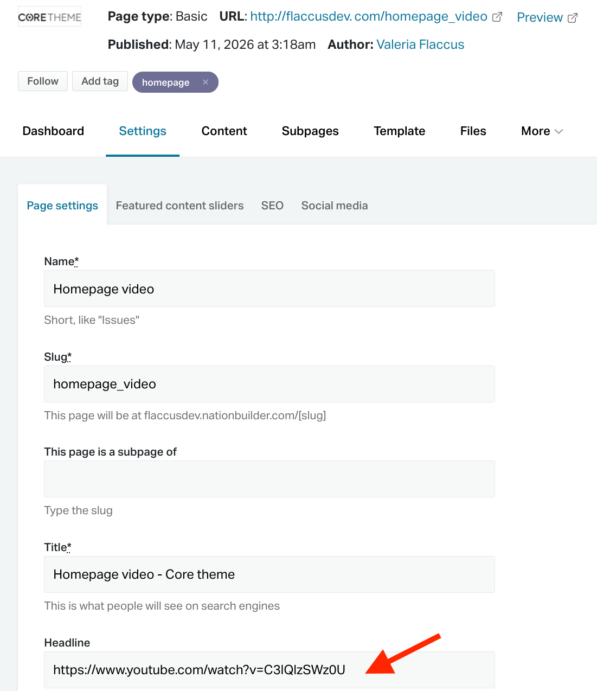
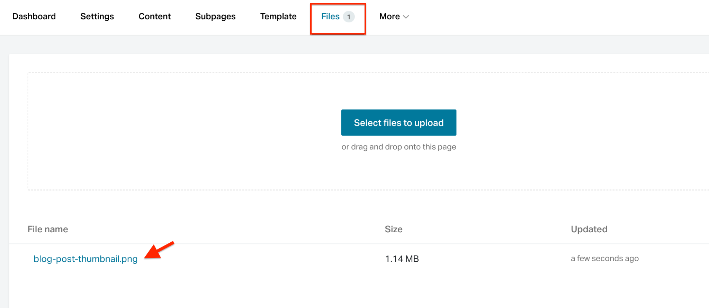
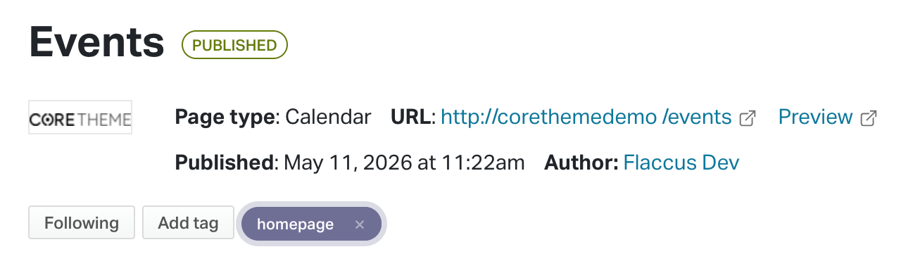

# **Release notes**

### **Release 1.1.0 (June 15th 2026\)**

* Integrated support for Vimeo on the video hero section of the homepage.  
* Added video mode with controls to the video hero section of the homepage.   
* Added ability to remove blog posts byline.

### **Release 1.0.0 (May 30th 2026\)**

First release

# **Site sections and page types**

## **Homepage**

### **How homepage section work**

The homepage is designed to display excerpts from other pages on your site. This allows you to feature key pages, such as the Blog, Events, Donation, Endorsement, Survey, or Suggestion Box pages, directly on the homepage. 

To show a page excerpt on the homepage, go to the page you want to feature and add the tag `homepage`. Once the tag has been added, the theme will automatically pull that page into the homepage and display it as a homepage section.

### **Adding a video hero section to the homepage** 

Adding a video hero section to the homepage

Video hero sections can be added to the homepage using a Basic page. Both YouTube and Vimeo videos are supported.

There are two video display modes available:

1. The default video mode displays the video as a full-screen background. It autoplays on a loop, has no visible controls, and plays without audio. Optional overlay text can be added on top of the video.  
2. The second video mode displays the video with controls, allowing visitors to click play and watch the video with audio. To use this version, add the tag `video_mode_control` to the Basic page. \[v1.1.0+\]

The setup process is the same for both video types. The only difference is whether or not the `video_mode_control` tag is added.

To add a video hero section to the homepage, first upload the video to YouTube or Vimeo.

Then, create a Basic page in NationBuilder and add the YouTube or Vimeo video URL under **Page settings \> Headline**.

If you want to display overlay text on top of the video, add that text to the page’s content editor.

Once the video URL and content have been added, tag the Basic page with `homepage`. The theme will then use that page to display the video section on the homepage.

To display the video with controls and audio, also add the tag `video_mode_control`.

### **Adding CTA hero sections to the homepage**

There are two CTA hero section layouts available for the homepage: the **Image and Text CTA Hero Section** and the **Parallax Background CTA Section**.

#### **Image and Text CTA Hero Section**

The Image and Text CTA Hero Section displays text, a button, and an image side by side.

To add this section to the homepage, create a **Basic** page and tag it with both `homepage` and `cta`.

The `homepage` tag tells the theme to display the page as a homepage section. The `cta` tag tells the theme to use the CTA layout.

To set up the section:

* Add the button label under **Settings \> Title**.  
* Add the button link under **Settings \> Headline**.  
* Add the section text in the **Content** editor.  
* Add the image under **Files**.

By default, the image appears on the left, with the text and button on the right. To move the image to the right, add the tag `image-right`.

#### **Parallax Background CTA Section**

The Parallax Background CTA Section displays the image as a full-width background image behind the CTA content.

To use this layout, create a **Basic** page and tag it with `homepage`, `cta`, and `parallax`.

To set up the section:

* Add the button label under **Settings \> Title**.  
* Add the button link under **Settings \> Headline**.  
* Add the section text in the **Content** editor.  
* Add the background image under **Files**.

Guidelines: the image file must be in JPG or PNG format and should use a landscape orientation.

### **Adding a hero section to the homepage with just an image and text**

To add an image \+ text hero section to the homepage, create a Basic page type and tag the page with homepage.

Add the image by navigating to **Files** and upload the image you want to display.

Guidelines: the image file must be jpg or png format and landscaped.

By default, the image will appear on the left hand side with the text on the right hand side. To change this around, add the tag `image-right`.

### **Changing the background color of homepage excerpts**

Some homepage excerpts can have their own background color. This is controlled by adding a dedicated color tag to the page that is being displayed on the homepage.

The page types that support custom excerpt background colors are: 

* Basic pages without a CTA or video  
* Event pages, FAQ pages   
* Feedback pages

Available background colors are based on the master theme’s predefined color list. If custom colors are required, they can be added to the theme as part of the initial setup. Once the colors have been defined, the available color list will be provided.

A theme color list may look like this:

\--color-core-violet: \#7b2fbf;

\--color-core-white: \#ffffff;

\--color-core-grey: \#ced4da;

\--color-core-light-grey: \#f1f1f1;

\--color-core-dark-grey: \#bfbfbf;

\--color-core-black: \#000000;

\--color-core-purple: \#a32fbf;

\--color-core-success: \#198754;

\--color-core-danger: \#dc3545;

\--color-core-warning: \#ffc107;

\--color-core-info: \#0dcaf0;

\--color-core-light: \#f8f9fa;

\--color-core-dark: \#212529;

\--color-core-muted: \#adb5bd;

To create the page tag, combine:

`color_bg_home_excerpt_` \+ the color name without `--color-`

For example, if the color in the list is:

`--color-core-violet`

remove `--color-`, leaving:

`core-violet`

Then add it after the tag prefix:

`color_bg_home_excerpt_core-violet`

Adding this tag to a supported homepage excerpt tells the theme to use the `--color-core-violet` background color for that section.

### **Using the homepage as an excerpt container**

By default, the homepage can display its own content from the NationBuilder content editor, along with any homepage excerpts pulled from other pages.

If you want the homepage to act only as a container for excerpts, add the tag `hp_container` to the homepage.

When this tag is added, the homepage will hide its own content and only display the excerpts from pages tagged with `homepage`. 

This is useful when you want to build the homepage entirely from reusable page sections instead of adding content directly to the homepage editor.

### **Changing the order of homepage sections**

Homepage sections can be reordered by adding a section order tag to each page that appears on the homepage.

To control the order, add one of the tags below to the page you want to position. Sections tagged with `hp_section_1` will appear first, followed by `hp_section_2`, then `hp_section_3`, and so on up to `hp_section_10`.

For example, if you want a specific homepage excerpt to appear first, add the tag `hp_section_1` to that page. If you want another excerpt to appear fourth, add the tag `hp_section_4` to that page.

This gives you control over the order of homepage sections without needing to edit the page template.

### **Editing homepage sections directly**

Each hero section displayed on the homepage includes an “*Edit this section*" button. To see this option, you must be logged in as an Admin.

This button appears when you hover over the section. Clicking it will take you directly to the relevant page in the NationBuilder control panel, where you can edit the content, files, and tags for that specific homepage excerpt.

This makes it easier to manage homepage sections without having to manually search for the page in the control panel.

### **Displaying Signup pages as a hero section of the homepage**

Signup pages can be displayed on the homepage in two different ways: 

* as a signup form section   
* as a Call to Action section

To display a Signup page as a form section, add the tag `homepage` to the Signup page.

To display a Signup page with the CTA layout, add both tags: `homepage` and `cta`.

The homepage tag tells the theme to show the page on the homepage, while the `cta` tag changes the layout from a signup form to a Call to Action section.

### **Adding animations to homepage sections**

Homepage sections can be animated as visitors scroll down the page.

To add an animation, assign an animation tag to the page being displayed as a homepage section.

The tag is created using this format:

`animation:` \+ the animation name

For example, to make a section fade into view from the top, add the tag:

`animation:fade-down`

The animation will be applied automatically when the section enters the visitor’s view.

**Available animations**

**Fade animations**

`animation:fade-up`

`animation:fade-down`

`animation:fade-left`

`animation:fade-right`

`animation:fade-up-left`

`animation:fade-up-right`

`animation:fade-down-left`

`animation:fade-down-right`

**Flip animations**

`animation:flip-up`

`animation:flip-down`

`animation:flip-left`

`animation:flip-right`

**Zoom animations**

`animation:zoom-in`

`animation:zoom-in-up`

`animation:zoom-in-down`

`animation:zoom-in-left`

`animation:zoom-in-right`

`animation:zoom-out`

`animation:zoom-out-up`

`animation:zoom-out-down`

`animation:zoom-out-left`

`animation:zoom-out-right`

For example, adding `animation:zoom-in` to a page will make that homepage section zoom into view as the visitor scrolls to it.

Only one animation tag should be added to each homepage section.

You can see a demo of all the available animations via this link: [https://michalsnik.github.io/aos/](https://michalsnik.github.io/aos/)

## **Footer**

### **Adding contact links to footer**

To add contact links to the footer, go to the **Homepage**, then open the **Subpages** tab and click **New subpage**.

Create a new page using the **Redirect** page type and set the page slug to **contact\_us**.

This redirect page is used to display the footer contact icons. 

The envelope icon will link to the URL added under the Redirect page’s “**URL to redirect to”** field. You can use this to link to a contact page, email form, or any other preferred contact URL.

The map pin and phone icons are pulled from your nation’s contact details. To update these, go to **Contacts and billing \> Contacts \> Account contact** in your NationBuilder control panel and add your address and phone number.

### **Adding social media links to the footer**

To add social media links to the footer, go to the **Homepage**, then open the **Subpages tab** and click **New subpage**.  
Create a new page using the **Redirect page** type. This redirect page will be used to display the relevant social media icon in the footer.  
The page name and slug should match the social media platform you want to show. Use the following options:

| Social media platform | Page name | Slug |
| :---- | :---- | :---- |
| Facebook | Facebook | facebook |
| Instagram | Instagram | instagram |
| LinkedIn | LinkedIn | linkedin |
| X / Twitter | Twitter | twitter\_x |
| Youtube | Youtube | youtube |

### **Adding a newsletter signup form**

To display a newsletter signup field in the footer, go to **Pages** \> **New page** in your NationBuilder control panel.  
Create a new page using the Signup page type and set the page slug to **newsletter\_join**.  
Once this page has been created with the correct slug, the theme will automatically display the newsletter signup field in the footer, allowing visitors to join your list by entering their email address.

### **Adding Footer legal links**

To add legal links to the footer, create a **Basic** page for each legal or policy page you want to include.

The theme will automatically display these pages as links in the footer when they use the correct slugs.

| Page name | Slug | Page type |
| :---- | :---- | :---- |
| Privacy | privacy | Basic |
| Terms | terms | Basic |
| Security | security | Basic |

## **Blog Page**

### **How to show the Blog page as a hero section on the homepage**

To display the Blog page as a hero section, or excerpt, on the homepage, add the tag `homepage` to the Blog page in the Control Panel..

### **How to add thumbnail images to a blog post card**

To add a thumbnail image to a Blog Post card, go to the relevant Blog Post page in your Control Panel, then open the **Files** tab and upload your image.  
The image file name must include the full word ***thumbnail*** for it to be used as the blog post thumbnail. For example: ***my-post-thumbnail.jpg***  
Avoid splitting the word or shortening it. The theme will only detect the image if the file name contains “thumbnail” exactly as one complete word.

### **Adding featured blog posts**

The Blog page can display selected posts as featured posts at the top of the page.

To feature a blog post, add one of the featured tags to the relevant Blog Post page. The tag you add determines the position of the post within the featured area.

For example, adding `featured_1` will display the post as the main featured blog post. 

Use the tags below to control where each featured blog post appears on the Blog page.

| Tag | Featured post position |
| :---- | :---- |
| featured\_1 | Main featured blog post |
| featured\_2 | Secondary featured blog post |
| featured\_3 | Third featured blog post |

This allows you to manually choose which blog posts should receive more visibility on the Blog page.

### **Adding an intro section to the Blog page**

To add an intro text section to the Blog page, create a new Basic subpage under the Blog page.  
Add the content you want to display in the Basic page’s content editor, then assign the tag `intro` to that Basic page.  
Once the tag has been added, the theme will automatically display that content as the intro section on the Blog page.

### **Hiding the Blog Post byline \[v1.1.0+\]**

By default, Blog Post pages display the author’s name in the byline, for example: Posted by \[author name\].  
To hide the byline from Blog Post pages, add the tag `hide_byline` to the Blog page.  
Once this tag has been added, the theme will hide the “Posted by” author name and avatar image from the Blog Posts cards within that Blog.

## **Calendar Page**

### **How to show the Calendar page as a hero section on the homepage**

To display the Calendar page as a hero section, or excerpt, on the homepage, add the tag `homepage` to the Calendar page in the Control Panel.

## **Event Page**

### **How to show the Event page as a hero section on the homepage**

To display the Event page as a hero section, or excerpt, on the homepage, add the tag `homepage` to the Event page in the Control Panel.

### **How to add thumbnail images to an Event page card**

To add a thumbnail image to an Event card, go to the relevant Event page in your Control Panel, then open the **Files** tab and upload your image.  
The image file name must include the full word ***thumbnail*** for it to be used as the blog post thumbnail. For example: ***my-post-thumbnail.jpg***  
Avoid splitting the word or shortening it. The theme will only detect the image if the file name contains “thumbnail” exactly as one complete word.

## **Donation (v2) Page**

### **Using the staged donation layout**

The Donation page can be displayed as a staged layout by adding the tag `staged_layout` to the Donation page.

When this tag is added, the theme will separate the donation form into multiple steps, creating a more guided donation experience for supporters.

